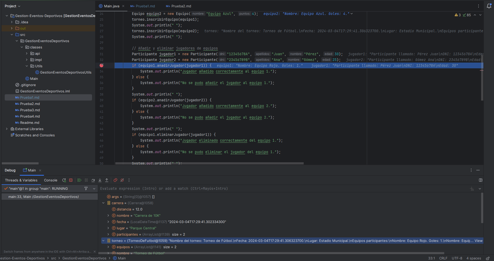

### Fallo
Al ejecutar Main aparece NullPointException en el método Inscribirparticipante de la clase EventosDeportivos.

### Prueba de Depuración
Al definir el arraylist de Jugadores en el constructor nos muestra participantes en nulo y al definir participantes en
las variables arrayList Participante participantes = new arrayList Participante. Funciona correctamente esa parte.

